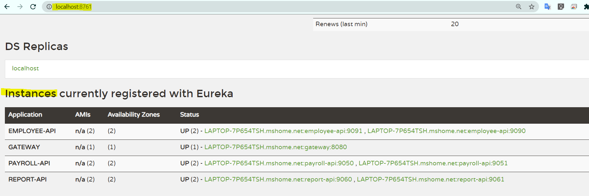

# Spring Cloud Microservices Hello World Application
In this tutorial we are going build two microservice applications  and expose they service via gateway. Users access the services using gateway

- Steps
    - Run employee service on 9090. Where it takes employee id and returns employee name
    - Run payroll service on 9050. Where it takes employee id and returns employee salary
    - Eureka Registry Server is running on port 8761
    - Spring Cloud Gateway (Spring Cloud load balancer) runs on port 8080
    - When rest api(employee-api,payroll-api) servers starts on 9090 and 9050 registers with Eureka Server.
    - Spring Cloud gateway uses Spring Cloud Load Balancer and routes all the requests that are coming on 8080 to respective application instances.
    - When ever a new rest api instance starts it registers with Eureka and routing is dynamically enabled by Gateway 
    - New application servers can be dynamically added
    - Application servers (service urls) are maintained in Registry
    - Netflix Eureka component plays a role of registry
    - Spring Cloud Load Balancer plays a role of Client side load balancer
    - Netflix Eureka Client is included in all the application servers (services)  and Gateway
# Source Code 
    git clone https://github.com/balajich/spring-cloud-microservices-hello-world.git
# Video
[](https://www.youtube.com/watch?v=8HQR6GdtI9o)
- https://youtu.be/8HQR6GdtI9o
# Architecture

# Prerequisite
- JDK 1.8 or above
- Apache Maven 3.6.3 or above
# Clean and Build
    mvn clean install
# Running components
- Registry: ``` java -jar .\registry\target\registry-0.0.1-SNAPSHOT.jar ```
- Employee API: ``` java -jar .\employee-api\target\employee-api-0.0.1-SNAPSHOT.jar ```
- Payroll API: ``` java -jar .\payroll-api\target\payroll-api-0.0.1-SNAPSHOT.jar ```
- Report API: ``` java -jar .\report-api\target\report-api-0.0.1-SNAPSHOT.jar ```
- Gateway: ```java -jar .\gateway\target\gateway-0.0.1-SNAPSHOT.jar ``` 

# Using curl to test environment
**Note I am running CURL on windows, if you have any issue. Please use postman client and collection is available 
at spring-cloud-microservices-hello-world.postman_collection.json**
- Access employee api directly: ``` curl -s -L  http://localhost:9090/employee/100 ```
- Access payroll api directly: ``` curl -s -L  http://localhost:9050/payroll/100 ```
- Access report api directly: ``` curl -s -L  http://localhost:9060/payroll/100 ```
- Access employee api via gateway: ``` curl -s -L  http://localhost:8080/employee/100 ```
- Access payroll api via gateway: ``` curl -s -L  http://localhost:8080/payroll/100 ```
- Access report api via gateway: ``` curl -s -L  http://localhost:8080/report/100 ```

**Note: Users will not access microservices (employee-api,payroll-api) directly. This will always access via gateway**
# Scale up restapi instances
Start two new instances of employee-api and payroll-api
- Employee API instance 2: ``` java -jar '-Dserver.port=9091' .\employee-api\target\employee-api-0.0.1-SNAPSHOT.jar ```
- Payroll API instance 2: ``` java -jar '-Dserver.port=9051' .\payroll-api\target\payroll-api-0.0.1-SNAPSHOT.jar ```
- Report API instance 2: ``` java -jar '-Dserver.port=9061' .\report-api\target\report-api-0.0.1-SNAPSHOT.jar ```
# Registry UI
Use Eureka Service registry UI to view all the micro service instances http://localhost:8761

# Next Steps
- Enhance existing application to run employee-api and payroll-api on dynamic ports.
- Ideally we will not care on which ports employee-api and payroll-api is running
- Gateway discovers these applications and establishes routes
# Next Tutorial
https://github.com/balajich/spring-cloud-microservices-hello-world-dynamic-ports

 
